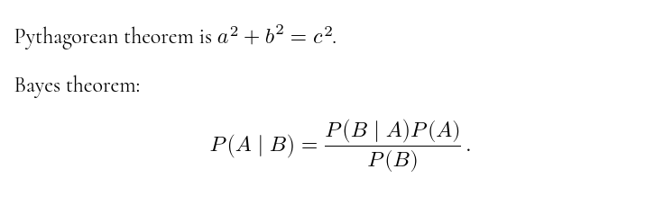

[](https://github.com/runarberg/markdown-it-math/actions/workflows/ci.yml)

[](https://www.npmjs.com/package/markdown-it-math)
[](https://github.com/runarberg/markdown-it-math/blob/main/LICENSE)
[](https://npm-stat.com/charts.html?package=markdown-it-math)

# markdown-it-math

**Note** This library defaults to rendering your equation with an
AsciiMath dialect. If you want to use LaTeX, follow the instructions
below.

```md
Pythagorean theorem is $a^2 + b^2 = c^2$.

Bayes theorem:

$$
P(A | B) = (P(B | A)P(A)) / P(B) .
$$
```



## Installation

```bash
npm install markdown-it-math --save

# Optional (use the default AsciiMath renderer)
npm install mathup --save

# Optional (use a LaTeX renderer instead)
npm install temml --save
```

### In a browser

Use an [importmap][importmap]. Change `/path/to/modules` to the
location of your modules.

```html
<!--mathup or temml are optional -->
<script type="importmap">
  {
    "imports": {
      "markdown-it": "/path/to/modules/markdown-it/index.mjs",
      "markdown-it-math": "/path/to/modules/markdown-it-math/index.js",
      "mathup": "/path/to/modules/mathup.js",
      "temml": "/path/to/modules/temml.mjs"
    }
  }
</script>
```

**Note** Importing [mathup][mathup] or [temml][temml] are
optional. Only import mathup if you want to use it as the default
AsciiMath renderer. Import Temml if you want to use it as the LaTeX
renderer.

## Usage

### With default AsciiMath (mathup) renderer

```js
import markdownIt from "markdown-it";
import markdownItMath from "markdown-it-math";

// Optional (with defaults)
const options = {
  inlineDelimiters: ["$", ["$`", "`$"]]
  blockDelimiters: "$$",
  defaultRendererOptions,
  inlineCustomElement, // see below
  inlineRenderer, // see below
  blockCustomElement, // see below
  blockRenderer, // see below
};

const md = markdownIt().use(markdownItMath, options);
```

```js
md.render(`
A text $1+1=2$ with math.

$$
bf A._(3 xx 3) =
[a_(1 1), a_(1 2), a_(1 3)
 a_(2 1), a_(2 2), a_(2 3)
 a_(3 1), a_(3 2), a_(3 3)]
$$
`);
```

You may also want to include the stylesheet from mathup. See
[mathup][mathup] for reference and usage instructions about the
default renderer.

### LaTeX (Temml)

```bash
npm install --save temml
```

```js
import markdownIt from "markdown-it";
import markdownItMath from "markdown-it-math";
import temml from "temml";

// Optional, if you want macros to persit across equations.
const macros = {};

const md = markdownIt().use(markdownItMath, {
  inlineRenderer: (src) => temml.renderToString(src, { macros }),
  blockRenderer: (src) =>
    temml.renderToString(src, { displayStyle: true, macros }),
});
```

```js
md.render(`
A text $1+1=2$ with math.

$$
\underset{3 \times 3}{\mathbf{A}} =
\begin{bmatrix}
  a_{1 1} & a_{1 2} & c_{1 3} \\
  a_{2 1} & a_{2 2} & c_{2 3} \\
  a_{3 1} & a_{3 2} & c_{3 3}
\end{bmatrix}
$$
`);
```

You may also want to include the stylesheets and fonts from Temml. See
[Temml][temml] for reference and usage instructions about the
default renderer.

### Options

- `inlineDelimiters`: A string, or an array of strings (or pairs of
  strings) specifying delimiters for inline math expressions. If a
  string, the same delimiter is used for open and close. If a pair of
  strings, the first string opens and the second one closes. Empty
  strings or pairs containing empty strings are ignored. If no valid
  strings or pairs are provided, it will turn off the rule.
  Default ``["$", ["$`", "`$"]]``.
- `blockDelimiters`: Same as above, but for block expressions. Default `"$$"`.
- `defaultRendererOptions`: The options passed into the default
  renderer. Ignored if you use a custom renderer. Default `{}`
- `inlineCustomElement`:
  Specify `"tag-name"` or `["tag-name", { some: "attrs" }]` if you want to
  render inline expressions to a custom element. Ignored if you provide a
  custom renderer.
- `inlineRenderer`:
  Provide a custom inline math renderer. Accepts the source content, the
  parsed markdown-it token, and the markdown-it instance. Default:

  ```js
  import mathup from "mathup";

  function defaultInlineRenderer(src, token, md) {
    return mathup(src, defaultRendererOptions).toString();
  }
  ```

- `blockCustomElement`:
  Specify `"tag-name"` or `["tag-name", { some: "attrs" }]` if you want to
  render block expressions to a custom element. Ignored if you provide a
  custom renderer.
- `blockRenderer`:
  Provide a custom block math renderer. Accepts the source content, the
  parsed markdown-it token, and the markdown-it instance. Default:

  ```js
  import mathup from "mathup";

  function defaultBlockRenderer(src, token, md) {
    return mathup(src, {
      ...defaultRendererOptions,
      display: "block",
    }).toString();
  }
  ```

## Examples

Using comma as a decimal mark

```js
import markdownIt from "markdown-it";
import markdownItMath from "markdown-it-math";

const md = markdownIt().use(markdownItMath, {
  defaultRendererOptions: { decimalMark: "," },
});

md.render("$40,2$");
// <p><math><mn>40,2</mn></math></p>
```

Render to a custom `<la-tex>` element

```js
import markdownIt from "markdown-it";
import markdownItMath from "markdown-it-math";

const md = markdownIt().use(markdownItMath, {
  inlineCustomElement: "la-tex",
  blockCustomElement: ["la-tex", { display: "block" }],
});

md.render(String.raw`
$\sin(2\pi)$.
$$
\int_{0}^{\infty} E[X]
$$
`);
// <p><la-tex>\sin(2\pi)</la-tex>.</p>
// <la-tex display="block">\int_{0}^{\infty} E[X]</la-tex>
```

Turning off inline math:

```js
import markdownIt from "markdown-it";
import markdownItMath from "markdown-it-math";

const md = markdownIt().use(markdownItMath, {
  inlineDelimiters: "",
});
```

```md
Only block math is allowed. $a^2$ will not render into inline math.

But this will render into block math:

$$
a^2
$$
```

Using LaTeX style delimiters:

```js
import markdownIt from "markdown-it";
import markdownItMath from "markdown-it-math";

const md = markdownIt().use(markdownItMath, {
  inlineDelimiters: [["\\(", "\\)"]],
  blockDelimiters: [["\\[", "\\]"]],
});
```

Note there are restrictions on what inline delimiters you can use,
based on optimization for the markdown-it parser [see here for
details][why-my-inline-rule-is-not-executed].

Block level math must be on its own lines.

```markdown
Some text with inline math \(a^2 + b^2 = c^2\)

And block math:
\[e = sum\_(n=0)^oo 1/n!\]

This expression \[P(x \in X) = 0\] will not render.
```

[importmap]: https://developer.mozilla.org/en-US/docs/Web/HTML/Element/script/type/importmap
[jsdelivr]: https://www.jsdelivr.com/
[mathup]: https://mathup.xyz/
[mathml]: https://www.w3.org/TR/MathML/
[markdown-it]: https://github.com/markdown-it/markdown-it
[Temml]: https://temml.org
[why-my-inline-rule-is-not-executed]: https://github.com/markdown-it/markdown-it/blob/master/docs/development.md#why-my-inline-rule-is-not-executed

## Upgrading From v4

Version 5 introduced some breaking changes, along with dropping legacy platforms.

- The `inlineOpen`, `inlineClose`, `blockOpen`, and `blockClose` options have
  been depricated in favor of `inlineDelimiters` and `blockDelimiters`
  respectively.
  ```diff
    markdownIt().use(markdownItMath, {
  -   inlineOpen: "$",
  -   inlineClose: "$",
  -   blockOpen: "$$",
  -   blockClose: "$$",
  +   inlineDelimiters: "$",
  +   blockDelimiters: "$$",
    });
  ```
- The default delimiters changed from `$$` and `$$$` for inline and
  block math respectively to `$` and `$$`. If you want to keep the
  thicker variants, you must set the relevant options:
  ```js
  markdownIt().use(markdownItMath, {
    inlineDelimiters: "$$",
    blockDelimiters: "$$$",
  });
  ```
- The options passed into the default mathup renderer has been renamed
  from `renderingOptions` to `defaultRendererOptions`:
  ```diff
    markdownIt().use(markdownItMath, {
  -   renderingOptions: { decimalMark: ",", },
  +   defaultRendererOptions: { decimalMark: ",", },
    });
  ```
- The default math renderer has been changed from Ascii2MathML to it’s
  successor mathup. There is a minor syntax and some output
  differences, so this may brake some of your old expressions: If you
  are afraid this happens you can opt into the legacy renderer:

  ```bash
  npm install ascii2mathml
  ```

  ```js
  import ascii2mathml from "ascii2mathml";

  // The old renderingOptions settings must be explicitly passed in.
  const mathRendererOptions = { decimalMark: "," };

  markdownIt().use(markdownItMath, {
    inlineRenderer: ascii2mathml(mathRendererOptions),
    blockRenderer: ascii2mathml({ ...mathRendererOptions, display: "block" }),
  });
  ```
